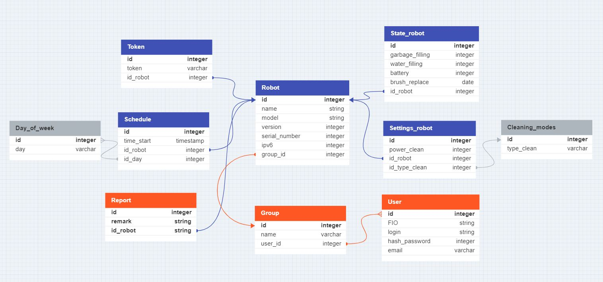
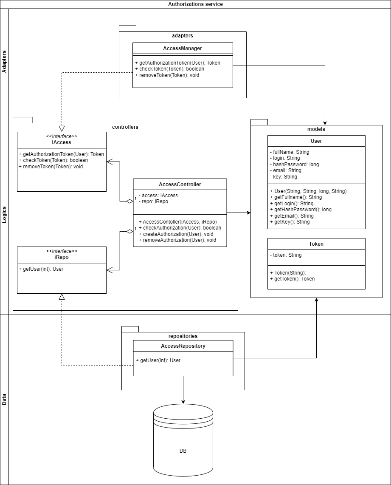

# Архитектура ПО (семинары)
## Урок 11. Сервис-ориентированные архитектуры
Задание (см. Блок 2) : https://geekbrainspro.notion.site/10-12-824e24672d0242f8b05bb34c842d7aca

Доработать пункты задания h, i, j, k, l.

Инструменты:

https://app.diagrams.net/

https://grafana.com/

https://prometheus.io/

### ERD_robot_vacuum_cleaner

### UML_micro_authentication_service

